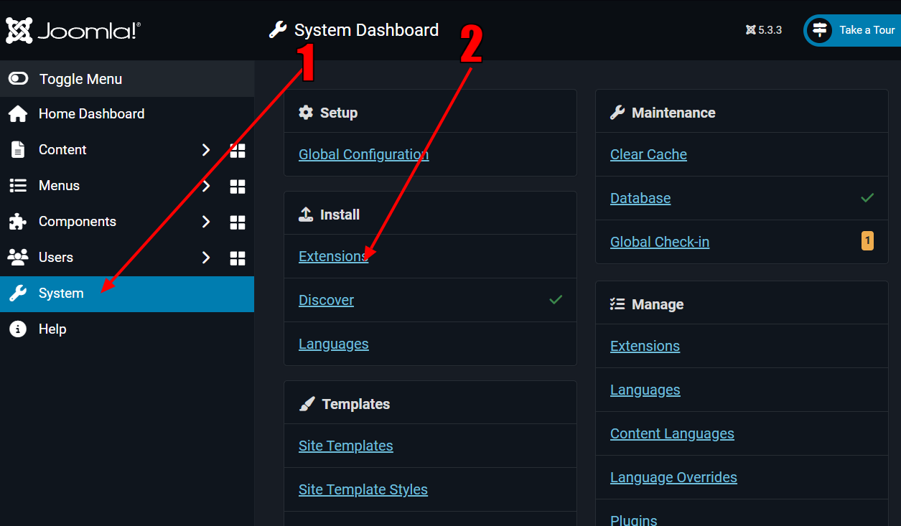
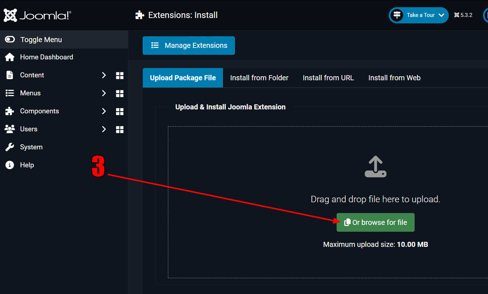
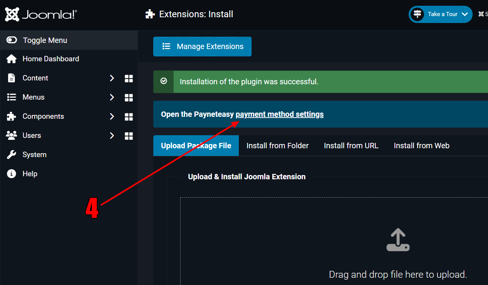
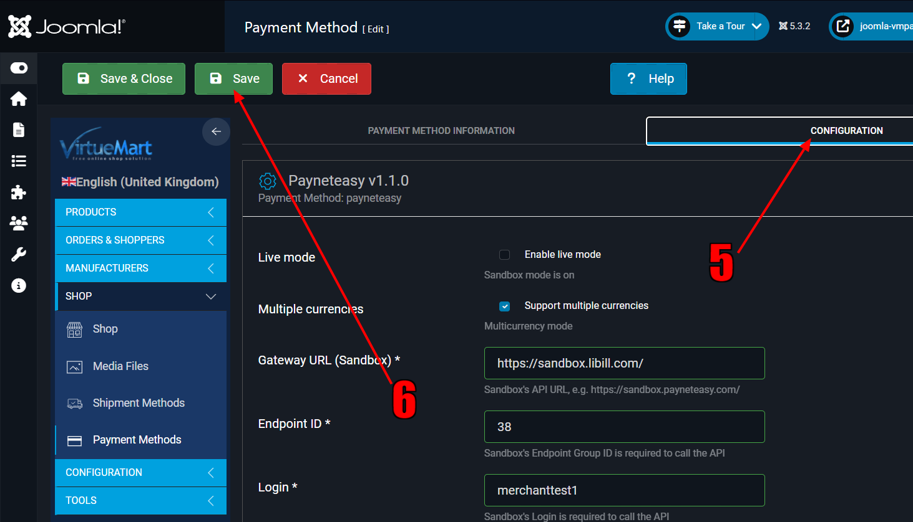

# Plugin for Joomla 5.x and VirtueMart 4.x for payment by PaynetEasy

tested on Joomla 5.3.2  
with VirtueMart 4.4.10

# Installation and configuration

1. In admin section "System"
2. Click "Install" / "Extensions" " 
3. Then upload file <a href="https://github.com/payneteasy/php-plugin-joomla-2/releases/download/v1.1.0/payneteasy.zip">payneteasy.zip</a> 
4. And click "payment method settings" 
5. Then click "Configure" section to fill necessary parameters
6. And "Save" your settings 
7. Installation and configuration completed.
